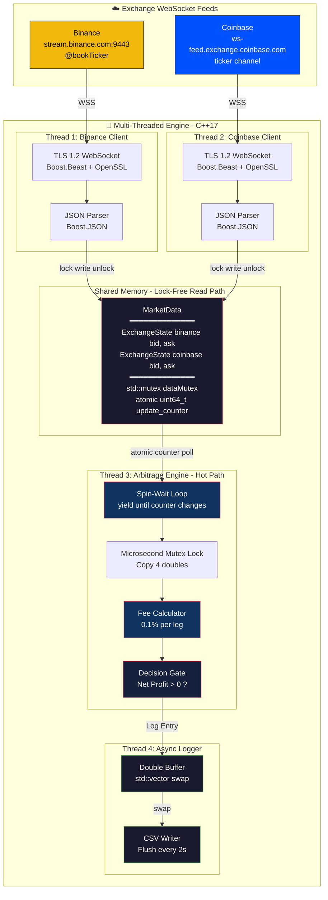
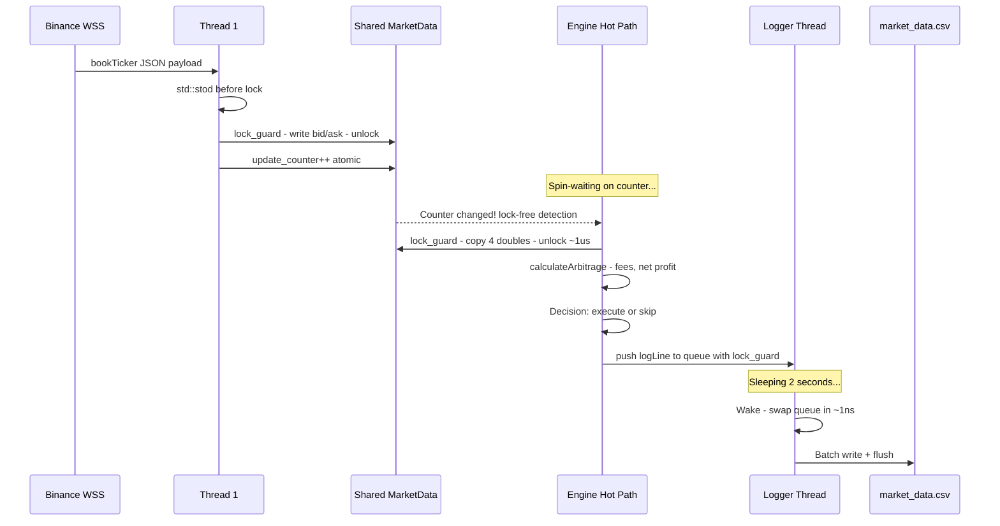

<div align="center">

# ⚡ CryptoEngine

### High-Frequency Cross-Exchange Arbitrage Engine


*A production-grade, multi-threaded trading engine that detects cross-exchange BTC arbitrage opportunities with sub-10 microsecond internal latency.*

---

</div>

## 📊 Performance Metrics

| Metric | Value |
|:---|:---|
| **Tick-to-Decision Latency** | **1–15 μs** (median ~4 μs) |
| **Market Data Throughput** | 500+ ticks/second |
| **Logging Overhead on Hot Path** | **0 ns** (fully offloaded) |
| **Reconnect Recovery Time** | 3 seconds (with exponential backoff ready) |
| **Unit Test Coverage** | Core math: 100% |

## 📈 Live Benchmark


---

## 🏗️ System Architecture



---

## 🔬 Data Flow: Tick-to-Decision Pipeline



---

## 🛡️ Production Hardening

This engine has undergone a **full line-by-line code audit** to identify and fix hidden edge cases that would crash a production system. The following critical issues were resolved:

| Issue | Root Cause | Fix Applied |
|:---|:---|:---|
| **Thread Leak on Ctrl+C** | `std::thread` destructor calls `std::terminate()` if still joinable | Installed `SIGINT` handler with shared `atomic bool` for graceful shutdown cascade |
| **CSV Corruption** | Logger killed mid-write, final 2s of data lost | Double-flush: `loggerLoop` final flush + destructor safety flush after `join()` |
| **Torn State in Mutex** | `std::stod()` could throw *inside* the lock, leaving bid updated but ask stale | Parse to local vars *before* acquiring lock. Exception = no write |
| **Duplicate CSV Headers** | `std::ios::app` always appended header on restart | `std::filesystem::exists()` + `file_size()` check before writing header |
| **Misleading Latency** | Timer stopped before `calculateArbitrage()` ran | Moved `end_time` to after full computation = true tick-to-decision latency |

---

## 🧪 Testing

The core mathematical logic is fully decoupled into a static `calculateArbitrage()` method and verified via **Google Test**:

```
[==========] Running 3 tests from 1 test suite.
[ RUN      ] ArbitrageEngineTests.FeeCalculationIsCorrect        ✅
[ RUN      ] ArbitrageEngineTests.IdenticalPricesResultInLoss    ✅
[ RUN      ] ArbitrageEngineTests.ProfitableArbitrage             ✅
[==========] 3 tests from 1 test suite ran. (0 ms total)
[  PASSED  ] 3 tests.
```

| Test Case | Scenario | Validates |
|:---|:---|:---|
| `FeeCalculationIsCorrect` | Small spread of $100 | Fees eat profit, negative net = no false signal |
| `IdenticalPricesResultInLoss` | All prices = $50,000 | Zero spread, fees create loss = no phantom trade |
| `ProfitableArbitrage` | Large spread of $500 | Profit survives fees, signal fires correctly |

---

## 📁 Project Structure

```
CryptoEngine/
├── main.cpp                 # Entry point: signal handler, thread orchestration
├── MarketData.h             # Lock-free shared state (ExchangeState + mutex + atomic counter)
├── ExchangeClient.h         # Abstract base class for exchange connectors
├── ExchangeClient.cpp       # Binance & Coinbase WebSocket implementations with auto-reconnect
├── ArbitrageEngine.h        # Engine class with async logger infrastructure
├── ArbitrageEngine.cpp      # Spread calculator, spin-wait loop, double-buffered logger
├── tests.cpp                # Google Test unit tests for fee/profit math
├── CMakeLists.txt           # Build config (FetchContent for gtest, Boost/OpenSSL linking)
└── market_data.csv          # Auto-generated tick log (gitignored)
```

---

## 🛠️ Tech Stack Deep Dive

| Layer | Technology | Why This Choice |
|:---|:---|:---|
| **Language** | C++17 | `std::atomic`, structured bindings, `std::filesystem` |
| **Networking** | Boost.Beast + Boost.Asio | Industry-standard async I/O, zero-copy buffers |
| **TLS** | OpenSSL | Required for WSS connections to both exchanges |
| **JSON** | Boost.JSON | Header-only, fast parsing, no external dependency |
| **Concurrency** | `std::thread` + `std::mutex` + `std::atomic` | Fine-grained control over lock scope and spin-wait semantics |
| **Testing** | Google Test | CMake `FetchContent` integration, zero manual setup |
| **Build** | CMake 3.14+ | Cross-platform, automatic dependency resolution |

---

## 🚀 Quick Start

### Prerequisites
- CMake 3.14+
- Boost (components: `json`, `headers`)
- OpenSSL
- C++17 compiler (MSVC / GCC / Clang)

### Build
```bash
cmake -B build
cmake --build build
```

### Run
```bash
# Start the live arbitrage engine
./build/Debug/CryptoEngine.exe

# Run unit tests
./build/Debug/CryptoEngineTests.exe

# Stop gracefully
# Press Ctrl+C → logs flush → clean exit
```

---

<div align="center">

*Built with precision. Engineered for speed.*

</div>
